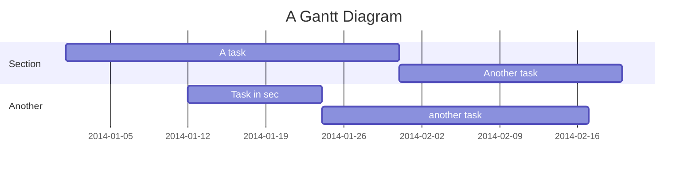

# aws-cli-samples



```puml
!define AWSPUML https://raw.githubusercontent.com/milo-minderbinder/AWS-PlantUML/release/18-2-22/dist
!includeurl AWSPUML/common.puml
!includeurl AWSPUML/Storage/AmazonS3/AmazonS3.puml
!includeurl AWSPUML/Storage/AmazonS3/bucket/bucket.puml

AMAZONS3(s3_internal)
AMAZONS3(s3_partner,"Vendor's S3")
s3_internal <-- s3_partner
```
