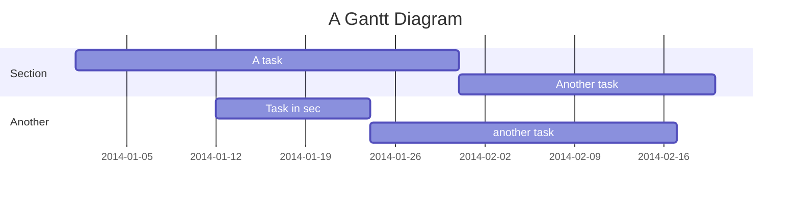

# aws-cli-samples

```mermaid
gantt
    title A Gantt Diagram
    dateFormat  YYYY-MM-DD
    section Section
    A task           :a1, 2014-01-01, 30d
    Another task     :after a1  , 20d
    section Another
    Task in sec      :2014-01-12  , 12d
    another task      : 24d
```

```plantuml
@startuml
!includeurl https://raw.githubusercontent.com/anthunt/aws-cli-samples/master/test.pu
@enduml
```
